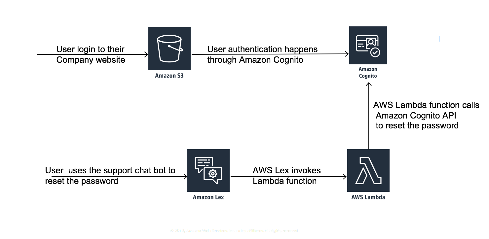

# Creating a support chatbot

In this workshop you'll create a support chat bot that will unlock and reset password of the user. You will do this in three stages, first you will deploy a website and then you will integrate it with Amazon Cognito service for user authentication purpose. Finally, you will be create a chat bot using Amazon Lex that can unlock and rest password for your website users.

The application architecture uses [Amazon Lex](https://aws.amazon.com/lex/), [AWS Lambda](https://aws.amazon.com/lambda/), [Amazon S3](https://aws.amazon.com/s3/), and [Amazon Cognito](https://aws.amazon.com/cognito/). S3 hosts static web resources including HTML, CSS, JavaScript, and image files which are loaded in the user's browser. Amazon Cognito provides user management.

See the diagram below for a depiction of the complete architecture.

If you'd like to jump in and get started please visit the [Static Web hosting](1_StaticWebHosting) module page to begin the workshop.

## Prerequisites

### AWS Account

In order to complete this workshop you'll need an AWS Account with access to create AWS IAM, Amazon Lex, S3, Lambda and Cognito resources. The code and instructions in this workshop assume only one student is using a given AWS account at a time. If you try sharing an account with another student, you'll run into naming conflicts for certain resources. You can work around these by appending a unique suffix to the resources that fail to create due to conflicts, but the instructions do not provide details on the changes required to make this work.

All of the resources you will launch as part of this workshop are eligible for the AWS free tier if your account is less than 12 months old. See the [AWS Free Tier page](https://aws.amazon.com/free/) for more details.

### Browser

We recommend you use the latest version of Chrome to complete this workshop.

### Text Editor

You will need a local text editor for making minor updates to configuration files.

## Modules

This workshop is broken up into multiple modules. You must complete each module before proceeding to the next, however, module 1 has an AWS CloudFormation template available that you can use to launch the necessary resources without manually creating them yourself.

1. [Static Web hosting](1_StaticWebHosting)
2. [User Management](2_UserManagement)
3. [Chat bot creation](3_CreateChatbot)

After you have completed the workshop you can delete all of the resources that were created by following the [cleanup guide](3_CleanUp).
